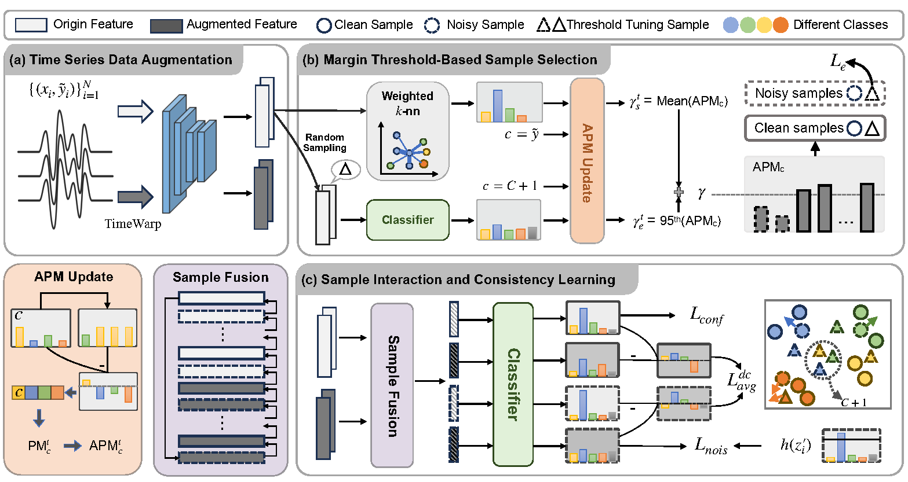

# DREAM: Dual Data-centric Separation with Circular Mixup for Noise-resistant Time Series Learning

This is the training code for our work "DREAM: Dual Data-centric Separation with Circular Mixup for Noise-resistant Time Series Learning". 
## Abstract
Deep neural networks (DNNs) have achieved extensive progress in time series learning. However, they could suffer from performance degradation when it comes to label noise in the real world. Towards this end, this paper studies a underexplored yet realistic problem of noise-resistant time series learning and propose a novel data-centric approach named D ual Data-cent r ic S eparation with Circular M ixup (DREAM) for this problem. The core of our DREAM is to explore and exploit the noisy data from dual data-centric views for reduced overfitting. On the one hand, we assume that samples with similar features share similar labels and infer the pseudo label of each sample using its affinity graph to capture the corresponding pseudo margin. On the other hand, we monitor the optimization status by simulating the mislabeled data to generate flexible criteria for accurate separation of clean and noisy samples. In addition, we leverage circular Mixup to interpolate between clean and noisy samples in the embedding space. These mixed samples are incorporated into a discrepancy-aware consistency learning framework to ensure robust time series representations of all the separated samples. Experimental results on a wide range of publicly accessible datasets reveal the effectiveness of our DREAM. 
<div align="center">

</div>

## Data
We evaluate our model on publicly available time-series classification datasets from the UCR and UEA repositories:

[The UCR time series archive](https://ieeexplore.ieee.org/abstract/document/8894743)

[The UEA multivariate time series classification archive, 2018](https://arxiv.org/abs/1811.00075)

All datasets are downloaded automatically during training if they do not exist.

## Usage
To train CTW on 13 benchmark datasets mentioned in this paper, run
```bash
nohup python ./src/main.py --model MixTS --epochs 300 --lr 1e-3 --label_noise 0 --embedding_size 32 --ni 0.3 --num_workers 1 --mean_loss_len 10 --gamma 0.3 --cuda_device 0 --outfile MixTS.csv >/dev/null 2>&1 &
```
The results are put in ```./statistic_results/```.


## Acknowledgement
We adapted the CTW open-source code to implement our algorithms
* [CTW](https://github.com/qianlima-lab/CTW.git)
